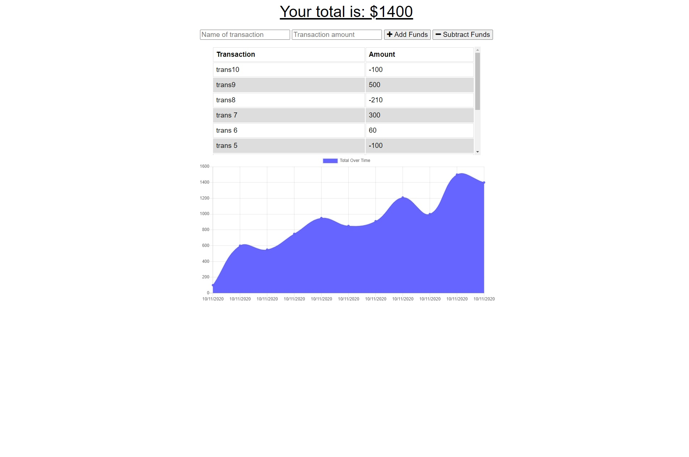

# Budget Tracker

## Description

This is a simple web app that lets the user track their deposits and expenses. The user simply adds the data to the app. The app then keeps a history of the user transactions in the backend DB, shows the user their history of transactions and charts the total funds over time, in addition to showing the current total funds.

This app will work when the user is offline by letting the user add deposits and expenses. The backend DB will get updated once the user is online again such that when the user accesses the app at some later time, it will get all the latest transactions from the backend.

In terms of implementation, IndexedDB is used to store pending transactions when the user is offline. When the user goes back online, the IndexedDb is read in order to update the backend and then cleared.

## Instructions

The app is deployed using heroku [here](https://frozen-crag-53405.herokuapp.com/). Simply navigate to the URL!